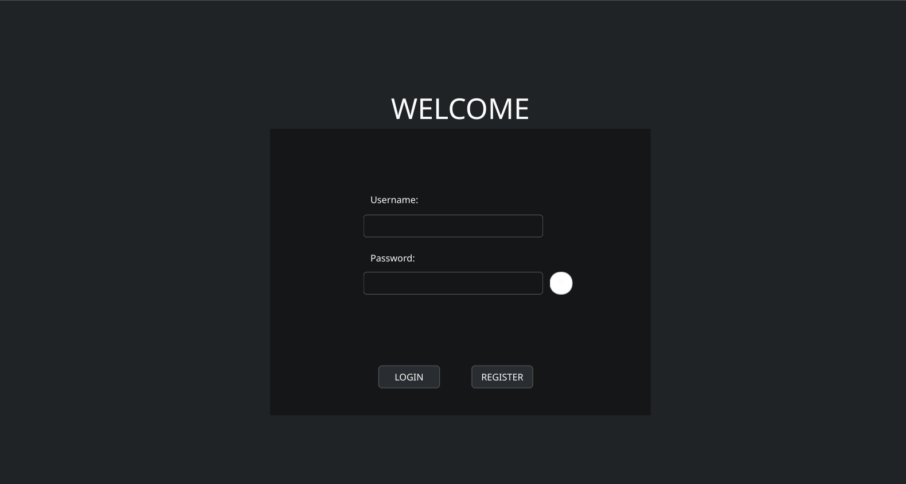
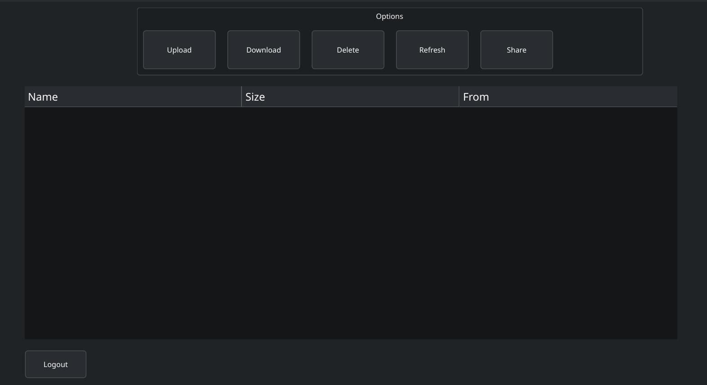

# Personal Could Storage — Remote File Management System


A client-server file management system built from scratch in C++17. Personal Could Storage allows authenticated users to upload, download, rename, delete, and navigate files and directories on a remote server through a native Qt6 desktop GUI. All communication is handled over a custom binary protocol running on top of TCP via Boost.Asio, with server-side persistence backed by SQLite3.

---

## Description

Personal Could Storage is a networked file storage platform designed to explore the fundamentals of systems programming: socket-level networking, concurrent session management, binary protocol design, and relational database integration. It provides a lightweight, self-hosted alternative to cloud storage services, where authenticated users interact with their personal remote file tree through an intuitive graphical interface. The project targets developers and students interested in understanding how full-stack networked desktop applications are architected at a low level, without relying on HTTP or REST abstractions.

---

## Visuals

> **Note:** Replace the placeholders below with actual screenshots or GIF recordings of the running application.

**Login and Registration Window:**



**Remote File Explorer:**



**Architecture Overview:**

```
┌──────────────┐         TCP (Binary Protocol)         ┌──────────────────┐
│              │ ────────────────────────────────────  │                  │
│   Qt6 GUI    │   LOGIN / REGISTER / UPLOAD / etc.    │   Async Server   │
│   Client     │ ────────────────────────────────────  │                  │
│              │ ◄──────────────────────────────────── │                  │
└──────────────┘        Response + Payload             │   ┌──────────┐   │
                                                       │   │ SQLite3  │   │
                                                       │   │   DB     │   │
                                                       │   └──────────┘   │
                                                       │   ┌──────────┐   │
                                                       │   │ ThreadPool│  │
                                                       │   └──────────┘   │
                                                       └──────────────────┘
```

---

## Tech Stack

| Layer         | Technology                                                                 |
|---------------|---------------------------------------------------------------------------|
| Language      | C++17                                                                      |
| GUI Framework | Qt 6 (Widgets, UIC)                                                        |
| Networking    | Boost.Asio (asynchronous I/O, TCP sockets)                                 |
| Database      | SQLite 3 (embedded, via amalgamation — `sqlite3.c` / `sqlite3.h`)          |
| Build System  | CMake 3.16+                                                                |
| Concurrency   | Custom thread pool, `pthread` |
| Serialization | Custom binary protocol with fixed-size headers and variable-length payloads|

---

## Features

- **User Authentication**: Registration and login system with SHA-256 password hashing via OpenSSL. Credentials are persisted in a server-side SQLite database. Duplicate username detection is enforced at the database level.

- **Custom Binary Protocol**: A hand-rolled application-layer protocol defines operation codes (LOGIN, REGISTER, UPLOAD, DOWNLOAD, DELETE, RENAME, CREATE_FOLDER, LIST, LOGOUT) exchanged over raw TCP. Each message consists of an 8-byte header (4-byte opcode + 4-byte payload size) followed by a variable-length body, enabling deterministic parsing without delimiters.

- **Asynchronous Server Architecture**: The server uses Boost.Asio's `io_context` for non-blocking socket I/O. Each client connection is managed by a dedicated `Session` object that performs asynchronous reads and writes, enabling high concurrency without a thread-per-connection model.

- **Thread Pool for Blocking Operations**: A fixed-size thread pool (`ThreadPool`) offloads CPU-bound or blocking tasks (database queries, filesystem operations) from the Asio event loop, preventing I/O starvation.

- **Remote File Explorer GUI**: A Qt6 Widgets-based desktop client featuring two windows:
  - `MainWindow`: Handles login and registration forms.
  - `FileExplorerWindow`: Displays the remote directory tree, supports navigation (double-click to enter directories, back button), and provides toolbar actions for upload, download, rename, delete, and folder creation.

- **Full File Lifecycle Management**: Users can upload local files to the server, download remote files to a local directory, rename files and folders, delete files and folders, and create new directories — all through the GUI.

- **Server-Side File Storage**: Uploaded files are stored on the server filesystem under a per-user directory hierarchy (`server_files/<username>/...`). Directory listings are generated dynamically from the actual filesystem, not from a database cache.

- **Per-User Isolation**: Each authenticated user operates within their own sandboxed directory tree. The server enforces path scoping so users cannot traverse outside their root.

- **Stateful Client Session**: The client maintains a persistent TCP connection and tracks the current authenticated user and working directory. Navigation state is managed client-side and synchronized with the server on each LIST request.

- **Chunked File Transfer**: File uploads and downloads use chunked reading/writing with a configurable buffer size (1 MB), enabling transfer of arbitrarily large files without loading the entire payload into memory at once.

---

## What I Learned

### Binary Protocol Design and Network Parsing

One of the biggest challenges was designing a reliable binary protocol from scratch. Unlike text-based protocols (HTTP, FTP), a binary framing protocol requires careful attention to message boundaries. I implemented a fixed-size header containing the operation code and payload length, followed by reading exactly that many bytes for the body. This forced me to deeply understand TCP's stream-oriented nature — specifically, that a single `recv()` call does not guarantee delivery of a complete application-level message. Handling partial reads and ensuring correct reassembly was a non-trivial exercise in low-level networking.

### Concurrency Primitives and Thread Safety

Implementing the `ThreadPool` class required mastering `pthread` with all it's conditional variables, mutexes, threads and  queuing of tasks. I learned firsthand how to avoid data races when multiple threads access shared state (the task queue) and how to implement graceful shutdown semantics using a stop flag combined with condition variable notification.

### Cross-Boundary State Management

Coordinating state between the Qt GUI thread and the asynchronous network layer was challenging. Qt's signal-slot mechanism cannot be directly invoked from a Boost.Asio handler running on a different thread. I used `QMetaObject::invokeMethod` with `Qt::QueuedConnection` to safely marshal responses back to the UI thread, which taught me about cross-thread communication patterns in event-driven GUI frameworks.

### Embedded Database Integration

Compiling SQLite3 directly from its amalgamation source (`sqlite3.c`) and interfacing with it through the C API (rather than an ORM) provided low-level insight into prepared statements, callback-based query execution, and schema management. The `Database` class encapsulates all SQL operations behind a clean C++ interface with RAII-style resource management.

---

## Installation and Setup

### Prerequisites

- **C++17-compatible compiler** (GCC 9+, Clang 10+, or MSVC 2019+)
- **CMake** >= 3.16
- **Qt 6** (Widgets module)
- **OpenSSL** (libssl, libcrypto — for SHA-256 hashing)
- **SQLite3** headers are bundled in the repository (no external install required)

### Build

```bash
# Clone the repository
git clone https://github.com/edia8/personal_cloud
cd personal_cloud

# Create an out-of-source build directory
mkdir build && cd build

# Configure with CMake
cmake ..

# Compile both the server and client targets
./compile.sh
```

This produces two binaries:

- `server` — the Personal Could Storage server daemon
- `client` — the Qt6 desktop client

### Run

**Start the server:**

```bash
./server
```

The server listens on the port defined in `SERVER/network.hpp` (default: `12345`). It will automatically initialize the SQLite database and create the `server_files/` storage directory on first launch.

**Start the client:**

```bash
./build/MyQtApp
```

The client connects to `127.0.0.1:6969` by default. Register a new account or log in with existing credentials to access the file explorer.

### Configuration

- **Server port**: Modify the port constant in [`SERVER/protocol.hpp`](SERVER/protocol.hpp).
- **Server address (client-side)**: Modify the host/port parameters in [`CLIENT/UI/mainwindow.cpp`](CLIENT/client.cpp).

---

## Project Structure

```
Personal Could Storage/
├── CMakeLists.txt              # Top-level build configuration
├── CLIENT/
│   ├── main.cpp                # Client entry point; initializes QApplication
│   ├── client.cpp              # Network client logic (connect, send, receive)
│   ├── client.hpp              # Client class declaration
│   └── UI/
│       ├── mainwindow.cpp      # Login/Register window implementation
│       ├── mainwindow.hpp      # MainWindow class declaration
│       ├── mainwindow.ui       # Qt Designer form for login/register
│       ├── fileexplorerwindow.cpp  # File explorer window implementation
│       ├── fileexplorerwindow.hpp  # FileExplorerWindow class declaration
│       └── fileexplorerwindow.ui   # Qt Designer form for file explorer
├── PROTOCOL/
│   └── protocol.hpp            # Shared protocol definitions (opcodes, header structure)
├── SERVER/
│   ├── server.cpp              # Server entry point; accepts connections
│   ├── session.hpp             # Per-client async session handler
│   ├── network.hpp             # Asio server class (acceptor, io_context)
│   ├── protocol.hpp            # Server-side protocol parsing utilities
│   ├── database.hpp            # SQLite3 wrapper (user CRUD, schema init)
│   ├── threadpool.hpp          # Fixed-size worker thread pool
│   ├── sqlite3.c              # SQLite3 amalgamation source
│   └── sqlite3.h              # SQLite3 amalgamation header
└── LICENSE
```

---

## License

This project is distributed under the terms of the license specified in the [LICENSE](LICENSE) file.
